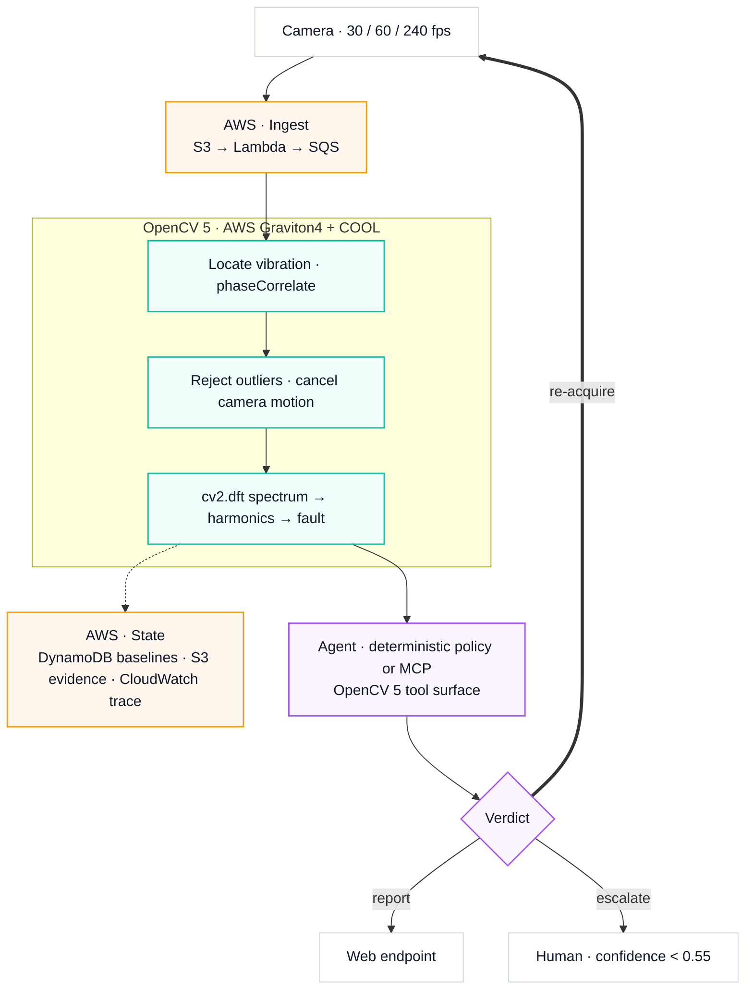

<p align="center">
  
</p>

<p align="center">
  <b>Machine vibration measured from ordinary handheld video.</b><br>
  OpenCV 5 recovers sub-pixel displacement; an agent decides what to measure next.
</p>

<p align="center">
  
  
  
  
  
</p>

<p align="center">
  <a href="REPORT.md"><b>Technical report</b></a> ·
  <a href="docs/THRESHOLDS.md">Thresholds</a> ·
  <a href="docs/MCP.md">MCP surface</a> ·
  <a href="deploy/README.md">Graviton runbook</a>
</p>

---

Vibration analysis catches rotating-machine failure before it happens. It normally
needs a contact accelerometer and a certified analyst, so most of the world's pumps,
motors, fans and gearboxes are never measured — they run to failure.

Camera-based motion amplification already exists commercially. Every such product is a
**visualisation tool**: it renders an amplified video and hands it to the analyst, who
remains the scarce, expensive part. **The gap is the analyst, not the algorithm.**

TREMOR measures the vibration *and* judges whether it can trust the measurement — going
back for a better clip when it cannot, and declining to answer when it still cannot.

## Measured results

| | |
|---|---|
| Real handheld iPhone clip, ground truth 7.30 Hz | **7.276 Hz — 0.33% error**, SNR 196 |
| Camera motion during that clip | **72.3 px peak-to-peak**, 25× the signal |
| 1×/2×/3× through shake + rolling shutter + glare + H.264 | **0.000 Hz error**, amplitude within ±5% |
| Smallest measurable motion | **0.01 px** at SNR 23.3 |
| Agent fault diagnosis (n=80) | **71.2%** overall · **87.7%** when it committed · 18.8% escalated |
| Agent accuracy vs how badly the operator aims | **flat at 79.2%** (single-shot: 8.3–75%) |

## Architecture



## Why handheld works

Hand motion and machine vibration live in different parts of the spectrum. Measured on
the real clip:

| Band | Share of camera-motion energy |
|---|---|
| 0.2–1 Hz (sway) | **78.6%** |
| 1–3 Hz | 15.4% |
| 3–5 Hz | 5.3% |
| **5–15 Hz (signal band)** | **0.7%** |

At 7.3 Hz the hand contributed 0.022 px against a 2.885 px signal — **131× separation**.
A tripod is not required by the physics. The same property drives automatic ROI
selection: high-pass each pixel in time and what remains is vibration, not sway.

## What a vision result changes

The loop is agentic because the measurement decides the *next acquisition*, not just
the next sentence.

| Measurement says | Agent does |
|---|---|
| texture below the correlation floor | re-aim at a grille, flange or label |
| SNR < 6, handheld | ask the operator to brace |
| SNR still low after bracing | try a more textured aim point |
| >15% of frames failing correlation | discard the clip |
| a needed harmonic above Nyquist | **re-acquire at 240 fps** |
| confidence < 0.55 | escalate to a human with the evidence |

The Nyquist case is the clearest: looseness is only separable via its 3× harmonic,
which sits above Nyquist at 30 fps for any shaft above 5 Hz. Routing those cases to
240 fps took looseness from 13 correct / 13 escalated to **19 correct / 7 escalated**.

## Quick start

```bash
python3 -m venv .venv && .venv/bin/pip install -r requirements.txt

.venv/bin/python run_gate.py                  # frequency accuracy, amplitude floor, shake rejection
.venv/bin/python eval_agent.py 80             # agent effectiveness + confusion matrix
.venv/bin/python sensitivity.py 24            # what the loop is worth, as a curve
.venv/bin/python -m pytest tests/             # phaseCorrelate mutation regression
.venv/bin/python analyze_video.py <clip.mov>  # measure your own footage
```

**Web endpoint** — no build step, no CDN, runs with uvicorn and nothing else:

```bash
.venv/bin/uvicorn webapp.server:app --port 8077
```

*Simulated* streams the agent loop step by step over SSE, so each decision appears as
it is made with the evidence beside it. *Upload clip* measures real footage and draws
the automatically-chosen regions on a preview frame.

## An upstream bug worth knowing about

`cv2.phaseCorrelate` in OpenCV 5.0.0 **mutates both source arrays in place** — it
multiplies each by the window. Code holding one array as a reference across calls
decays it as `base × window^N`; with a Hanning window the usable aperture collapses
after ~700 calls and **11% of frames return displacements up to ±92 px on a ±0.8 px
signal**.

Verified: observed base matched predicted `orig × window^N` to **7 significant
figures** at N = 1, 2, 10, 100, 700. Two behaviours we had documented as physical
limitations turned out to be this bug — 240 fps clips went from SNR 2.9 to **229**, and
smooth surfaces from FAIL to PASS. Pinned by
[`tests/test_phasecorrelate_mutation.py`](tests/test_phasecorrelate_mutation.py).

## Layout

```
tremor/     measurement core + validation generators
agent/      perception-decision-action loop, tool surface, MCP server
bench/      COOL/Graviton benchmark harness with falsifiable provenance
webapp/     FastAPI endpoint + single-page UI
deploy/     Graviton + COOL deployment, one-shot benchmark runner
docs/       architecture, thresholds and their empirical basis, MCP design
tests/      regression tests
```

## Status

Measurement core, agent, MCP surface, benchmark harness and web endpoint are built and
evidenced. **Pending:** the Graviton/COOL benchmark run, web deployment, and validation
against a real machine rather than a controlled target. Those are marked
`[PENDING]` in the [technical report](REPORT.md) and contain no invented figures.

Every threshold in the system is a measurement, not a guess —
[`docs/THRESHOLDS.md`](docs/THRESHOLDS.md) records what was run and what it showed,
including the results that went against us.
