<p align="center">
  
</p>

<p align="center">
  <b>Machine vibration measured from ordinary handheld video.</b><br>
  OpenCV 5 recovers sub-pixel displacement; an agent decides what to measure next.
</p>

<p align="center">
  
  
  
  
  
</p>

<p align="center">
  <a href="http://50.19.247.214"><b>▶ Live demo</b></a> &nbsp;·&nbsp;
  <a href="https://youtu.be/vS2g5MvfPmo"><b>▶ Demo video, 3 min</b></a> &nbsp;·&nbsp;
  <a href="REPORT.md"><b>Technical report</b></a> &nbsp;·&nbsp;
  <a href="submission/TESTING.md"><b>How to verify every claim</b></a>
</p>

---

### For judges, in one place

| | |
|---|---|
| **Working endpoint** | **<http://50.19.247.214>** · press *Run agent*, nothing to install |
| **Video** | **<https://youtu.be/vS2g5MvfPmo>** · 3 min |
| **Technical report** | [REPORT.md](REPORT.md) · problem, users, architecture, OpenCV 5, AWS, evaluation, limitations, responsible use |
| **Testing instructions** | [submission/TESTING.md](submission/TESTING.md) · reproduce every number, including on your own footage |
| **Architecture diagram** | [docs/architecture.svg](docs/architecture.svg) · OpenCV 5, AWS, COOL and agent components |
| **Agent workflow diagram** | [docs/agent-workflow.svg](docs/agent-workflow.svg) · perception, decision, action |
| **Evaluation evidence** | [REPORT.md §6](REPORT.md) and [docs/THRESHOLDS.md](docs/THRESHOLDS.md) · including the failures |
| **Limitations** | [REPORT.md §8](REPORT.md) · stated, not buried |
| **COOL and Graviton evidence** | [REPORT.md §7](REPORT.md) · raw results with provenance in [`results/`](results/) |
| **Agent trace** | [`out/agent_trace.json`](out/agent_trace.json) · or watch it stream live on the endpoint |
| **MCP surface** | [docs/MCP.md](docs/MCP.md) · 8 tools, `python demo_mcp.py` runs the loop with no LLM |
| **Deployment runbook** | [deploy/README.md](deploy/README.md) |
| **Thresholds and their basis** | [docs/THRESHOLDS.md](docs/THRESHOLDS.md) · every number measured, not guessed |

**Fastest meaningful check:** open the endpoint, press *Run agent*, and watch the
trace on the right. The agent is not told the fault, the shaft speed, or whether its
first clip is usable. Ground truth is printed under the verdict.

---

Vibration analysis catches rotating-machine failure before it happens. It normally
needs a contact accelerometer and a certified analyst, so most of the world's pumps,
motors, fans and gearboxes are never measured — they run to failure.

Camera-based motion amplification already exists commercially. Every such product is a
**visualisation tool**: it renders an amplified video and hands it to the analyst, who
remains the scarce, expensive part. **The gap is the analyst, not the algorithm.**

TREMOR measures the vibration *and* judges whether it can trust the measurement — going
back for a better clip when it cannot, and declining to answer when it still cannot.

## Measured results

| | |
|---|---|
| Real handheld iPhone clip, ground truth 7.30 Hz | **7.276 Hz — 0.33% error**, SNR 196 |
| **Real ceiling fan**, handheld | **2.406 Hz = 144 RPM**, cross-checked against blade-pass ÷ 5 blades to **1.2%** |
| Camera motion during that clip | **72.3 px peak-to-peak**, 25× the signal |
| 1×/2×/3× through shake + rolling shutter + glare + H.264 | **0.000 Hz error**, amplitude within ±5% |
| Smallest measurable motion | **0.01 px** at SNR 23.3 |
| Agent fault diagnosis (n=80) | **71.2%** overall · **87.7%** when it committed · 18.8% escalated |
| Agent accuracy vs how badly the operator aims | **flat at 79.2%** (single-shot: 8.3–75%) |

**On AWS Graviton4 (c8g.2xlarge), COOL vs stock OpenCV 5 on the same instance:**

| | ms/frame | ×realtime | $/video-hour |
|---|---|---|---|
| stock OpenCV 5.0.0 | 5.21 | 6.4 | $0.0498 |
| **COOL 5.1.0-dev + KleidiCV** | **4.14** | **8.1** | **$0.0419** |

**1.26× end-to-end**, 16% cheaper per unit of work. `phaseCorrelate` is 68% of op
time and gains 1.21×; `dft_2d` gains 1.87×. Four ops show no gain — all reported.

Process scaling at 8 workers: **92% parallel efficiency on Graviton4 (50.0× realtime)
versus 37% on an Apple M-series (22.8×)**, a prediction the report made before the run
and the benchmark confirmed.

## Architecture

<p align="center">
  
</p>

<sub>Source: <a href="docs/architecture.mmd"><code>docs/architecture.mmd</code></a> · regenerate with <a href="docs/render-diagrams.sh"><code>docs/render-diagrams.sh</code></a><br><b>Dashed grey = designed but not yet implemented.</b> The OpenCV 5 pipeline, the agent and the decision trace are built and exercised by the test suite; the COOL/Graviton leg is benchmarked (§7.3). S3/Lambda/SQS ingest and DynamoDB/CloudWatch state are the intended production path and are <i>not</i> yet wired into the application — S3 and EC2 were used operationally to run the benchmark, but no application code calls them.</sub>

### The agent workflow

<p align="center">
  
</p>

<sub>Source: <a href="docs/agent-workflow.mmd"><code>docs/agent-workflow.mmd</code></a>. Perception is OpenCV 5 with no learned model. The decision ladder is deterministic and reads only tool output, never a prompt. Every action that is not a verdict issues a <b>new acquisition</b>, which is what makes this a loop closed on the physical world rather than a report generator.</sub>

## Why handheld works

Hand motion and machine vibration live in different parts of the spectrum. Measured on
the real clip:

| Band | Share of camera-motion energy |
|---|---|
| 0.2–1 Hz (sway) | **78.6%** |
| 1–3 Hz | 15.4% |
| 3–5 Hz | 5.3% |
| **5–15 Hz (signal band)** | **0.7%** |

At 7.3 Hz the hand contributed 0.022 px against a 2.885 px signal — **131× separation**.
A tripod is not required by the physics. The same property drives automatic ROI
selection: high-pass each pixel in time and what remains is vibration, not sway.

## What a vision result changes

The loop is agentic because the measurement decides the *next acquisition*, not just
the next sentence.

| Measurement says | Agent does |
|---|---|
| texture below the correlation floor | re-aim at a grille, flange or label |
| SNR < 6, handheld | ask the operator to brace |
| SNR still low after bracing | try a more textured aim point |
| >15% of frames failing correlation | discard the clip |
| a needed harmonic above Nyquist | **re-acquire at 240 fps** |
| confidence < 0.55 | escalate to a human with the evidence |

The Nyquist case is the clearest: looseness is only separable via its 3× harmonic,
which sits above Nyquist at 30 fps for any shaft above 5 Hz. Routing those cases to
240 fps took looseness from 13 correct / 13 escalated to **19 correct / 7 escalated**.

## Run it locally, on any system

**Python 3.12 or newer is required**: numpy 2.5.3 publishes no wheel below cp312, so
older versions try to build it from source and usually fail. Check with
`python3 --version`. Wheels exist for every pin on Windows, Linux and macOS, x86_64
and arm64.

<table>
<tr><th align="left">macOS and Linux</th><th align="left">Windows, PowerShell</th></tr>
<tr valign="top"><td>

```bash
git clone https://github.com/TusharTechs/tremorcv
cd tremorcv
python3 -m venv .venv
source .venv/bin/activate
pip install -r requirements.txt
```

</td><td>

```powershell
git clone https://github.com/TusharTechs/tremorcv
cd tremorcv
py -3.12 -m venv .venv
.venv\Scripts\Activate.ps1
pip install -r requirements.txt
```

</td></tr>
</table>

On Windows, if PowerShell refuses to run the activate script, either run
`Set-ExecutionPolicy -Scope Process RemoteSigned` first, or use
`.venv\Scripts\activate.bat` from `cmd.exe`. Everything after activation is
identical on all three systems.

### The web endpoint

```bash
uvicorn webapp.server:app --port 8000
```

Then open <http://localhost:8000>. No build step and no CDN, so nothing else is
needed. *Simulated* streams the agent loop over SSE, so each decision appears as it
is made with its evidence beside it. *Upload clip* measures real footage and draws
the automatically chosen regions on a preview frame.

The same thing is already running at **<http://50.19.247.214>** if you would rather
not install anything.

### Everything else

```bash
python -m pytest -q             # 38 regression tests, about a minute
python demo_mcp.py              # drive the whole loop over MCP, no LLM or API key
python run_agent.py             # one machine, one agent run, printed trace
python eval_agent.py 80         # agent effectiveness + confusion matrix, ~12 min
python run_gate.py              # frequency accuracy, amplitude floor, shake rejection
python sensitivity.py 24        # what the loop is worth, as a curve
python analyze_video.py <clip>  # measure your own footage
```

One extra check is **Unix only**, because it exercises the deployment scripts under
`env -i`: `bash tests/test_deploy_scripts.sh`. Run it under WSL on Windows, or skip
it. Four of our deployment failures were things that work on macOS and break on
Linux, which is why it exists.

`requirements.txt` pins **opencv-python-headless** deliberately: nothing here calls
cv2's GUI functions, and the full wheel links libGL, which a server, a container or
WSL without desktop libraries does not have. Using the full wheel is what broke the
first deployment.

## An upstream bug worth knowing about

`cv2.phaseCorrelate` in OpenCV 5.0.0 **mutates both source arrays in place** — it
multiplies each by the window. Code holding one array as a reference across calls
decays it as `base × window^N`; with a Hanning window the usable aperture collapses
after ~700 calls and **11% of frames return displacements up to ±92 px on a ±0.8 px
signal**.

Verified: observed base matched predicted `orig × window^N` to **7 significant
figures** at N = 1, 2, 10, 100, 700. Two behaviours we had documented as physical
limitations turned out to be this bug — 240 fps clips went from SNR 2.9 to **229**, and
smooth surfaces from FAIL to PASS. Pinned by
[`tests/test_phasecorrelate_mutation.py`](tests/test_phasecorrelate_mutation.py).

## Layout

```
tremor/       measurement core and validation generators
agent/        perception, decision, action loop · tool surface · MCP server
bench/        COOL and Graviton benchmark harness with falsifiable provenance
webapp/       FastAPI endpoint and single page UI
deploy/       Graviton and COOL deployment, one shot benchmark runner
docs/         architecture and agent diagrams, thresholds, MCP design
tests/        38 regression tests
results/      raw benchmark output, with the provenance block
video/        the demo video and the scripts that record and assemble it
submission/   technical report as PDF, and the testing instructions
```

## Status

Everything described here is **built and measured**. Nothing in the report is
projected or estimated, and there are no `[PENDING]` figures left in it.

| | |
|---|---|
| Measurement core, agent, MCP surface | built, 38 tests |
| COOL and Graviton benchmark | run on c8g.2xlarge, results in [`results/`](results/) with a provenance gate |
| Web endpoint | deployed and reachable at <http://50.19.247.214> |
| Validation against a real machine | ceiling fan, handheld, 2.406 Hz and 144 RPM, cross checked to 1.2% |

The parts of the architecture diagram drawn in **dashed grey** are designed but not
implemented: S3, Lambda and SQS ingest, and DynamoDB and CloudWatch state. S3 and EC2
were used operationally to run the benchmark, but no application code calls them, and
the diagram says so rather than implying a system larger than the one that exists.

Every threshold is a measurement, not a guess. [`docs/THRESHOLDS.md`](docs/THRESHOLDS.md)
records what was run and what it showed, **including the results that went against us**:
an ablation that turned out to measure scenario difficulty rather than the value of the
loop, a benchmark whose first run measured nothing because `PYTHONPATH` leaked, and two
bugs the project found in itself.

## Licence

MIT. See [LICENSE](LICENSE).
