# TREMOR — Agentic Vibration Intelligence

**Measuring machine vibration from ordinary video, with an agent that decides what to
measure next.**

OpenCV AI Competition 2026 · technical report

> **Status note.** Every number in this report is measured and reproducible from the
> commands given in §10. Nothing here is projected or estimated. The COOL/Graviton
> figures in §7.3 come from a run whose provenance is recorded in `results/`, and the
> web endpoint in §7.4 is live. What is *not* yet done — validation against a real
> machine rather than a controlled target — is stated in §8 rather than glossed.

---

## 1. Problem, and who has it

Vibration analysis is the most reliable way to catch rotating-machine failure before
it happens. Unbalance, misalignment and looseness each leave a distinct signature in
the displacement spectrum at multiples of shaft speed, and a trained analyst can name
the fault from the ratio of 1×, 2× and 3× amplitudes.

The method works. The problem is access to it. It conventionally requires a contact
accelerometer mounted on the machine and a certified analyst to interpret the
spectrum. Both are scarce and expensive, so the overwhelming majority of the world's
pumps, motors, fans, gearboxes and HVAC equipment are never measured at all. They run
to failure.

Camera-based motion amplification already exists commercially — RDI Technologies'
Iris platform, Erbessd's Dragon Vision, gfaitech's WaveCam, Failure Prevention
Associates' Visual Vibration. We are not claiming to have invented measuring vibration
from video. Every one of those products, however, is a **visualisation tool**: it
renders an amplified video or an operating-deflection shape and hands it to the
analyst, who remains the scarce, expensive part. They are also offline desktop
software or manual upload services, and none of them decides anything.

**The gap is the analyst, not the algorithm.** TREMOR's contribution is a system that
judges its own measurement quality, goes and gets a better clip when the one it has
cannot support a conclusion, and declines to answer when it still cannot.

**Target user.** Maintenance technicians and facilities staff at sites that cannot
justify a dedicated vibration programme: mid-size plants, building services, campus
and municipal estates, small manufacturers. People who own machines and own a phone.

---

## 2. What it does

Point a camera at a machine for ten seconds. TREMOR returns the shaft speed, the
amplitudes at 1×/2×/3×, a fault classification, a confidence, and the evidence — or
it tells you why it cannot answer and what to do differently.

It works handheld. On the validation clip in §6.1 the operator's hand moved the
camera **72 px peak to peak**, twenty-five times the amplitude being measured, and
the frequency came out to **0.33%**.

---

## 3. Architecture

<p align="center">
  
</p>

<sub>Source: <a href="docs/architecture.mmd"><code>docs/architecture.mmd</code></a> · regenerate with <a href="docs/render-architecture.sh"><code>docs/render-architecture.sh</code></a><br><b>Dashed grey = designed but not yet implemented.</b> The OpenCV 5 pipeline, the agent and the decision trace are built and exercised by the test suite; the COOL/Graviton leg is benchmarked (§7.3). S3/Lambda/SQS ingest and DynamoDB/CloudWatch state are the intended production path and are <i>not</i> yet wired into the application — S3 and EC2 were used operationally to run the benchmark, but no application code calls them.</sub>

Capture → S3 → Lambda → SQS → **OpenCV 5 pipeline on AWS Graviton under COOL** →
DynamoDB/S3 state → agent → verdict. The verdict either reports, escalates to a
human, **or issues a new acquisition request**, which is the loop that makes this
agentic rather than a report generator.

---

## 4. The OpenCV 5 implementation

This is the substance of the project, so it is described in the order the data flows.

### 4.1 Why a vision-language model cannot do this

The output is a displacement of **41 micrometres at 58.4 Hz**. There is no prompt for
that. Every stage below is a metric measurement on pixel data; no part of the
measurement path involves a learned model at all.

### 4.2 Stage 1 — locate what is vibrating (`tremor.measure.auto_rois`)

Splitting the frame in half is a bad default: on a real clip the machine occupies a
fraction of the shot and averaging it with static background dilutes the signal.
Measured on the validation clip: **SNR 4.1** with a half-split versus **196** with
hand-placed regions.

Raw temporal energy is also wrong, and failed instructively. With a handheld camera
*everything* moves, so the highest-energy box is wherever contrast × shake is largest.
On the real clip that selected the **laptop keyboard** as the machine and the
actually-oscillating target as the "static" reference — producing a correct frequency
for entirely the wrong reason.

The fix uses a measured property of hand motion (§6.2): 78.6% of its energy sits below
1 Hz and only 0.7% lands in the 5–15 Hz band where machine vibration lives. Each pixel
is therefore high-passed in time — subtract a moving average over ~1/2.5 s — before
energy is computed. `cv2.boxFilter` over the resulting energy and texture maps selects
the target box; the reference is the lowest-energy well-textured box that does not
overlap it. On the same clip this selects the vibrating region with **4.4× separation**
from its reference, **SNR 86.9**, quality gate passing.

### 4.3 Stage 2 — sub-pixel displacement (`cv2.phaseCorrelate`)

Per frame, against a reference frame, windowed with `cv2.createHanningWindow`. This
is the hot path: **3.05 ms/call against under 0.26 ms for every other operation
combined**, so it alone determines end-to-end throughput.

**An upstream bug, found and fixed.** `cv2.phaseCorrelate` in OpenCV 5.0.0 **mutates
both source arrays in place** — it multiplies each by the window. Code that holds one
array as a reference across calls therefore decays it as `base × window^N`. With a
Hanning window (0.99992 at centre, 0.0078 at edge) the edges vanish after ~2 calls and
the usable aperture collapses by ~700, after which correlation fails catastrophically:
**11% of frames returned displacements up to ±92 px on a ±0.8 px signal.**

Verified: observed base matched predicted `orig × window^N` to **7 significant figures**
at N = 1, 2, 10, 100, 700. With identical inputs, 2400 calls returned 2400 different
values; with a defensive copy, 1000 calls return one. Pinned by
[`tests/test_phasecorrelate_mutation.py`](tests/test_phasecorrelate_mutation.py),
which also asserts the upstream mutation still occurs so the workaround can be removed
if OpenCV fixes it.

The bug had been masquerading as two "physical limitations" we had written up as
inherent. Both disappeared on fixing it (§6.4).

### 4.4 Stage 3 — reject correlation failures (`clean_trace`)

Two independent detectors, because neither alone suffices. **MAD**: real vibration is
bounded and smooth, so a sample many robust deviations from the median is not physical.
**Correlation response**: `cv2.phaseCorrelate` returns a peak-strength value as its
third element — easy to discard, but failures correlate with low values (median 0.063
on bad frames versus 0.095 on good). A high reject fraction is not silently patched;
it is surfaced as a reason for the agent to re-acquire.

### 4.5 Stage 4 — cancel camera motion

A second ROI on something rigid gives the camera's own motion, which is subtracted.
This is **adaptive**, because stabilisation is not free: both ROIs carry independent
measurement noise, so subtracting a near-zero reference adds √2× noise. Measured: above
~0.5 px signal the *unstabilised* SNR is higher (36.8 versus 20.9); between 0.2 and
0.5 px stabilisation is essential. The system stabilises only when the reference is
actually moving.

### 4.6 Stage 5 — temporal spectrum

Hann window, `cv2.dft`, one-sided amplitude with coherent-gain correction so the peak
height equals the true sine amplitude in pixels.

### 4.7 Stage 6 — shaft rate and fault

**Shaft rate by harmonic comb.** The obvious heuristic — lowest peak above the SNR
threshold — is wrong and was a major error source: for misalignment the 2× component
dominates and 1× can fall below the floor, so it returns *twice* the true rate, reads
2× as 1×, and inverts the diagnosis to unbalance. Measured at a true 4.30 Hz,
lowest-peak returned a spurious 0.50 Hz on three of four fault classes; the comb
returned 4.30 on all four. A `FUNDAMENTAL_MIN_SHARE` guard prevents `f/2` winning —
that candidate explains the true 1× as its own 2× but has nothing at its own
fundamental.

**Harmonics gated against the noise floor before ratios are taken.** On a quiet machine
2× and 3× are genuinely ~0.02 px, far below the floor, so a ratio test on them
*invents* a fault. An n=80 confusion matrix localised almost all remaining error to
exactly this: `healthy` scored 3/12 while every other class ran 75–100%, producing 9 of
13 total errors. Gating lifted `healthy` to 10/13 and overall correct-when-answered
from 78.3% to 86.4%.

Three cases that were previously conflated are now distinct: all harmonics below the
floor (`below_measurement_floor`, confidence 0, escalate); only 1× above the floor
(`healthy` — the correct physical reading, not a fallback); a harmonic above Nyquist
(recorded as *unobservable*, distinct from "measured ≈ 0", confidence × 0.6).

Every threshold and its empirical basis is in
[`docs/THRESHOLDS.md`](docs/THRESHOLDS.md).

---

## 5. The agentic layer

Vision results change the **next acquisition**, not just the next sentence.

| Measurement says | Agent does |
|---|---|
| texture below the correlation floor | re-aim at a grille, flange or label |
| SNR < 6, handheld | ask the operator to brace |
| SNR still low after bracing | try a more textured aim point |
| >15% of frames failing correlation | discard the clip |
| a needed harmonic above Nyquist | **re-acquire at 240 fps** |
| confidence < 0.55 | escalate to a human with the evidence |

The Nyquist case is the clearest instance. Mechanical looseness is only separable from
unbalance via its 3× harmonic, which sits above Nyquist at 30 fps for any shaft above
5 Hz. The agent derives this from **its own shaft estimate** and re-acquires at 240 fps
— but only when confidence is low *specifically because* a needed harmonic is missing,
so misalignment and unbalance still resolve in a single 30 fps clip. Effect: looseness
went from 13 correct / 13 escalated to **19 correct / 7 escalated**.

**Two orchestrators, one tool surface.** A deterministic policy
([`agent/loop.py`](agent/loop.py)) is the reproducible reference — a judge can run the
full evaluation with no API key and no cloud account. An MCP server
([`agent/mcp_server.py`](agent/mcp_server.py)) exposes the same tools so any MCP client
can orchestrate, which the rules explicitly permit.

**Guard rails live in the tools, not the prompt.** `diagnose` *refuses* when 2× exceeds
Nyquist rather than returning a plausible wrong answer, and `assess_quality` returns
structured machine-readable reasons rather than prose. A model can ignore a prompt
instruction; it cannot ignore a tool error.

---

## 6. Evaluation

### 6.1 Real footage, handheld

A 20.2 s iPhone clip at 29.995 fps, **fully handheld**, of a target oscillating at a
known 7.30 Hz.

| | |
|---|---|
| Measured | **7.276 Hz** |
| Ground truth | 7.30 Hz |
| Error | **0.33%** (bin width 0.049 Hz) |
| SNR | 196 (hand-placed ROIs) · 86.9 (automatic) |
| Camera motion | 20.5 px rms, **72.3 px peak-to-peak** |

Stabilisation reduced total motion from 22.3 px rms to 2.9 px — and 2.9 px is
essentially the expected signal alone (4 px amplitude ÷ √2 = 2.83).

### 6.2 Why handheld works — the measured reason

| Band | Share of camera-motion energy |
|---|---|
| 0.2–1 Hz (sway) | **78.6%** |
| 1–3 Hz | 15.4% |
| 3–5 Hz | 5.3% |
| **5–15 Hz (signal band)** | **0.7%** |

At 7.3 Hz the hand contributed 0.022 px against a 2.885 px signal — **131× separation**.
Hand motion and machine vibration occupy different parts of the spectrum, so a static
reference plus a temporal transform separates them. A tripod is not required by the
physics.

### 6.3 Synthetic degradations, exact ground truth

A three-component fault signature (1× at 3.1 Hz, 2× at 6.2 Hz, 3× at 9.3 Hz) with the
**real measured hand-motion trace replayed** onto it, degradations stacked:

| Condition | 1× err | 2× err | 3× err | Amplitude err | SNR |
|---|---|---|---|---|---|
| Baseline | 0.000 Hz | 0.000 | 0.000 | +2.0% | 189.0 |
| + real handheld shake | 0.000 | 0.000 | 0.000 | −0.9% | 42.4 |
| + rolling shutter | 0.000 | 0.000 | 0.000 | −0.8% | 35.6 |
| + specular glare | 0.000 | 0.000 | 0.000 | −1.1% | 38.2 |
| + H.264 compression | 0.000 | 0.000 | 0.000 | −0.8% | 35.8 |

Frequency accuracy is exact across 1.7–14.2 Hz. Amplitude sensitivity reaches
**0.01 px** at SNR 23.3.

### 6.4 Two "limitations" that were the bug

Both were documented as physical limits before the `phaseCorrelate` fix:

| | Before | After |
|---|---|---|
| 240 fps / 10 s clip | 106.70 Hz, SNR 2.9, 40% rejected | **11.30 Hz, SNR 229, 0% rejected** |
| Smooth surface (contrast 0.15) | FAIL — +0.250 Hz, SNR 1.6 | **PASS — 0.000 Hz, SNR 36.8** |
| Amplitude floor | 0.03 px | **0.01 px** |

The texture threshold, derived from the corrupted data, was recalibrated from 15.0 to
**2.0** — it had been rejecting usable surfaces and forcing needless re-aims.

### 6.5 Agent task effectiveness (n = 80)

| | Agent |
|---|---|
| Fault correct, all scenarios | **71.2%** |
| Fault correct when it committed | **87.7%** |
| Escalated rather than guessed | 18.8% |
| Median shaft-frequency error | **0.000 Hz** |
| Mean acquisitions | 1.86 |

Per class when answered: looseness 19/19, misalignment 20/21, unbalance 11/14,
healthy 7/11.

### 6.6 What the loop is worth — a curve, not a ratio

A single agent-versus-baseline ratio is not a defensible claim. Across three of our own
changes the single-shot baseline read 21.2%, then 70.0%, then 27.5%, while the agent
held at 86–88%. **That number was mostly measuring how hard we had made the starting
conditions** — a knob the author controls. So we swept it (n=24 per point, identical
machines at every point, only the initially-aimed-at surface varying):

| Initial surface | Contrast | Agent (all) | Agent (committed) | Single-shot | Acquisitions |
|---|---|---|---|---|---|
| mirror housing | 0.010 | **79.2%** | 95.0% | **8.3%** | 2.21 |
| glossy paint | 0.040 | **79.2%** | 95.0% | 75.0% | 1.04 |
| worn paint | 0.150 | **79.2%** | 90.5% | 75.0% | 1.04 |
| printed label | 0.550 | **79.2%** | 86.4% | 70.8% | 1.12 |
| cast grille | 1.000 | **79.2%** | 86.4% | 70.8% | 1.12 |

**The agent's accuracy is flat at 79.2% regardless of how badly the operator aims**,
while single-shot spans 8.3–75%. It pays the extra-acquisition cost only when it needs
to — 2.21 acquisitions on an unusable surface, 1.04 on a workable one.

The claim is **invariance to a bad first acquisition**, not a multiple. Where the
operator already aims well and holds steady, the loop converges toward single-shot and
costs a fraction of an extra acquisition. Its value is bounded by how often first
acquisitions are inadequate — an operational question about deployment, not a property
of the algorithm.

---

## 7. AWS deployment and COOL

### 7.1 Why this workload belongs on Graviton

The hot path is `cv2.phaseCorrelate`, `remap`, `dft` and `boxFilter` — classical
imgproc/core, exactly the 78 functions COOL accelerates with Arm KleidiCV. There is no
neural network anywhere in the measurement path, so the Graviton case is genuine rather
than decorative.

Two measured properties shape the deployment:

- **`phaseCorrelate` is ~100% of the hot path** (3.05 ms/call versus under 0.26 ms for
  everything else combined).
- **Thread scaling is flat** (6.7× realtime at 1 thread, 6.8× at 8) — it does not
  parallelise internally. Throughput comes from **N single-threaded worker processes,
  one per vCPU**, each calling `cv2.setNumThreads(1)` to avoid oversubscription.

Local process scaling on an 8-core Apple M-series: 100% / 95% / 60% / 39% parallel
efficiency at 1 / 2 / 4 / 8 workers — consistent with heterogeneous performance and
efficiency cores. **Graviton4 has uniform cores, so we predict better linearity.** The
benchmark will confirm or refute this.

### 7.2 Provenance, and a deliberate false positive

"Verified COOL integration" is 30% of the COOL award rubric, so the check must be
falsifiable. Grepping `cv2.getBuildInformation()` for KleidiCV **returns true on any
ARM Mac**, because stock arm64 wheels bundle it — a check that always passes proves
nothing.

`bench/core.py` therefore requires all three: Arm silicon **and** a Graviton EC2
instance type **and** `/opt/cool` actually present, and records the AMI ID so a judge
can cross-check it against the Marketplace listing.
`deploy/run_all.sh` **aborts before collecting any data** if that check fails, so stock
numbers cannot be written under a COOL label.

### 7.3 Results

Measured 2026-09-22 on **c8g.2xlarge** (Graviton4, 8 vCPU, us-east-1). Both legs ran
on the **same instance**, so the library is the only variable.

| | COOL | stock baseline |
|---|---|---|
| OpenCV | **5.1.0-dev** (KleidiCV) | 5.0.0 |
| loaded from | `/opt/cool/...` | `/root/stock-venv/...` |
| `cv2_loaded_from_cool` | **true** | **false** |
| `PYTHONPATH` | COOL's | empty |

The provenance gate is reported first deliberately: an earlier run produced a
plausible-looking 0.4% difference because `PYTHONPATH` leaked and *both* legs loaded
COOL. Numbers are meaningless until the two legs are shown to differ.

**End-to-end — the claimed core workload**

| | ms/frame | ×realtime | video-h per compute-h | speedup |
|---|---|---|---|---|
| stock OpenCV 5.0.0 | 5.21 | 6.4 | 6.4 | — |
| **COOL** | **4.14** | **8.1** | **8.1** | **1.26×** |

**Per-operation** (ms/call, speedup vs stock)

| op | stock | COOL | |
|---|---|---|---|
| `phaseCorrelate` | 3.701 | **3.050** | **1.21×** |
| `dft_2d` | 1.188 | **0.634** | **1.87×** |
| `dft_1d_8192` | 0.046 | 0.042 | 1.10× |
| `cvtColor_BGR2GRAY` | 0.022 | 0.022 | 1.01× |
| `remap_cubic` | 0.170 | 0.172 | 0.99× |
| `GaussianBlur` | 0.355 | 0.361 | 0.98× |
| `warpAffine` | 0.174 | 0.179 | 0.97× |
| `resize_half` | 0.013 | 0.015 | 0.90× |

`phaseCorrelate` is **68% of measured op time**, so its 1.21× largely sets the
end-to-end result. The biggest single win is `dft_2d` at 1.87×, which matters because
`phaseCorrelate` is itself DFT-bound. Four operations show no gain, one is slightly
slower; we report them rather than quoting only the favourable rows.

**Cost per video-hour** (EC2 $0.31904/hr verified against the AWS Pricing API; COOL
software $0.02/hr from the Marketplace listing)

| | $/video-hour |
|---|---|
| stock on a plain AMI | $0.0498 |
| stock on the COOL AMI | $0.0530 |
| **COOL** | **$0.0419** |

COOL is **16% cheaper per unit of work** than stock on a plain AMI, and 21% cheaper
than stock on the same COOL instance. The software charge is more than repaid by the
throughput.

**Scaling — the architectural argument for Graviton**

Thread scaling is flat for stock (6.4× at 1, 2, 4 and 8 threads), confirming
`phaseCorrelate` does not parallelise internally. COOL gains a little (6.8 → 8.1).
Throughput therefore comes from independent worker processes:

| workers | Graviton4 (COOL) | Graviton4 (stock) | Apple M-series |
|---|---|---|---|
| 1 | 6.8× (100%) | 6.4× (100%) | 7.7× (100%) |
| 2 | 13.6× (100%) | 12.8× (100%) | 12.0× (79%) |
| 4 | 26.4× (97%) | 25.0× (98%) | 17.7× (58%) |
| 8 | **50.0× (92%)** | **48.0× (94%)** | 22.8× (37%) |

§7.1 predicted that Graviton4's uniform cores would scale more linearly than the
Apple M-series' heterogeneous performance/efficiency cores. **Confirmed: 92–94%
parallel efficiency at 8 workers versus 37%**, for 50.0× aggregate realtime against
22.8×. All three runs use the same `spawn` start method, so the comparison is fair.

**Caveat on the comparison.** COOL ships OpenCV **5.1.0-dev** while the stock wheel is
**5.0.0**, so the 1.26× conflates KleidiCV optimisation with whatever changed upstream
between 5.0 and 5.1. A same-version comparison would need a source build of 5.1.0-dev
without KleidiCV, which we have not done. The figure is a fair measure of *what COOL
delivers over the best available stock wheel*, which is the decision a deployer
actually faces — but it is not a clean isolation of KleidiCV.

Reproduce with `./deploy/run_all.sh c8g.2xlarge`; raw result JSON is in `results/`.

### 7.4 Web endpoint

**Live at <http://50.19.247.214>** — deployed 2026-09-22 on an EC2 `t4g.small`
(Graviton2, us-east-1) behind a static Elastic IP, open to `0.0.0.0/0`. Running as a
systemd unit with `MemoryMax`, `CPUQuota` and `NoNewPrivileges` set, because a public
endpoint that runs computer vision on uploaded video needs its blast radius bounded.

FastAPI serving a single page with **no build step and no CDN dependency** — charts are
drawn on canvas directly, so a judge can run the identical app locally with
`uvicorn webapp.server:app` and nothing else. Two modes:

- **Simulated** streams the agent loop over SSE, so each decision appears as it is made
  with the measurement that drove it beside it. A static results page would show the
  vision *result*; streaming shows the vision result *changing what happens next*.
- **Upload clip** measures real footage, locates the vibrating region and a rigid
  reference automatically, and draws the chosen regions on a preview frame so the
  operator can see what was measured rather than having to trust it.

`/api/health` reports the OpenCV version and live COOL provenance. It correctly reads
`cool_verified: false` here: this host runs stock OpenCV 5.0.0, and the COOL-verified
figures in §7.3 came from the `c8g.2xlarge` benchmark. The provenance check earning its
keep by *declining* to claim COOL is the same property that made §7.3 trustworthy.

Deployment is reproducible from `deploy/webapp-userdata.sh`, and
`tests/test_deploy_scripts.sh` guards the two traps that cost a deploy each: the
service must install `opencv-python-headless` (the full wheel links `libGL`, absent on
servers, which crash-looped the unit 50 times), and it must verify `import cv2`
succeeds before handing anything to systemd.

**Known limitation:** the endpoint is HTTP, not HTTPS. There is no login and no
personal data, but browsers will flag it as not secure and some corporate proxies
block bare IP addresses. A domain name with automatic certificates would resolve both
and is the remaining polish item.

---

## 8. Limitations

Stated plainly, because several of them bound what the system can honestly claim.

**The agent is evaluated against a simulator we wrote.** Every agent figure in §6.5 and
§6.6 comes from a simulated acquisition environment authored alongside the agent, with
thresholds tuned against that same environment. The flat 79.2% curve is a property of
our simulator; it is evidence that the loop behaves as designed, **not** evidence of
field accuracy. Real-world agent validation is outstanding.

**Real-world validation is one clip, of a screen.** §6.1 is rigorous but it measures a
laptop displaying a test pattern, not a machine. Real surfaces have specular
highlights, depth and uneven illumination that no synthetic degradation fully captures.

**Frame rate caps the measurable band.** 30 fps → 15 Hz (900 RPM); 240 fps → 120 Hz
(7200 RPM). Bearing defect frequencies are in the kHz and are **out of reach entirely**.
The scope is 1×/2×/3× faults — unbalance, misalignment, looseness, resonance — which is
most of the diagnostic value, but not all of it.

**Featureless surfaces fail.** Below texture std ≈ 2 there is nothing to correlate. The
agent detects and re-aims, but a machine that is entirely mirror-finish under flat
light cannot be measured from where the operator is standing.

**The texture metric saturates.** `assess_surface` bottoms out at the sensor-noise
floor: contrast 0.010 (which fails) and 0.040 (which works) both read ≈ 2.0. It is a
fast path, not the arbiter; SNR is.

**Amplitude is in pixels, not millimetres.** Converting to physical units needs a known
scale in frame. Frequency — which drives the diagnosis — is unaffected.

**Optical image stabilisation may fight the measurement.** It actively opposes small
motion. It did not visibly affect the validation clip, but it is the first suspect if
amplitudes read low.

**Fault taxonomy is coarse.** Four classes. Real diagnosis includes belt faults,
bearing stages, cavitation, electrical faults and more.

---

## 9. Responsible use

**A wrong diagnosis has a cost.** It dispatches a technician to perform the wrong
repair, or worse, declares a degrading machine healthy. This is why the system is built
to **decline**: below 0.55 confidence it escalates with its evidence rather than
asserting, and it does so in 18.8% of runs. We report correct-when-committed (87.7%)
separately from overall accuracy precisely so this trade is visible rather than hidden
in an average.

**It is a screening tool, not a certification.** Output is intended to prioritise
attention and trigger a closer look, not to replace a certified analyst for
safety-critical equipment. The interface shows confidence and evidence on every result.

**Privacy.** The system measures machines, not people. Clips are of equipment, uploaded
deliberately rather than captured continuously; there is no always-on recording, no
identity inference and no person-tracking anywhere in the pipeline. Where footage might
incidentally include people, operators should frame to exclude them — and the automatic
ROI selection, which targets high-frequency periodic motion, is by construction drawn
to machinery rather than human movement.

**Data handling.** Clips and derived spectra live in the operator's own AWS account.
Nothing is shared with third parties. The measurement path runs no third-party model
and makes no external network calls.

**No misrepresentation.** Every figure here is measured, not projected. Cost claims
were withheld until the EC2 rate was verified against the AWS Pricing API. Negative
results are reported alongside favourable ones — four of the eight benchmarked
operations show no gain from COOL, and one is slower. The limits of our own evaluation,
including that the agent is scored against a simulator we wrote, are in §8 rather than
omitted.

---

## 10. Reproducibility

```bash
python3 -m venv .venv && .venv/bin/pip install -r requirements.txt

.venv/bin/python run_gate.py            # frequency accuracy, amplitude floor, shake rejection
.venv/bin/python run_machine_eval.py    # degradation stack against exact ground truth
.venv/bin/python eval_agent.py 80       # agent task effectiveness + confusion matrix
.venv/bin/python sensitivity.py 24      # the curve in §6.6
.venv/bin/python -m pytest tests/       # phaseCorrelate mutation regression
.venv/bin/python analyze_video.py <clip.mov>
.venv/bin/uvicorn webapp.server:app --port 8077
```

Dependencies are pinned to exact versions. `requirements-cool.txt` deliberately omits
`opencv-python` so it cannot shadow the COOL build on the AMI.

All evaluation uses fixed seeds; the figures above reproduce exactly.
